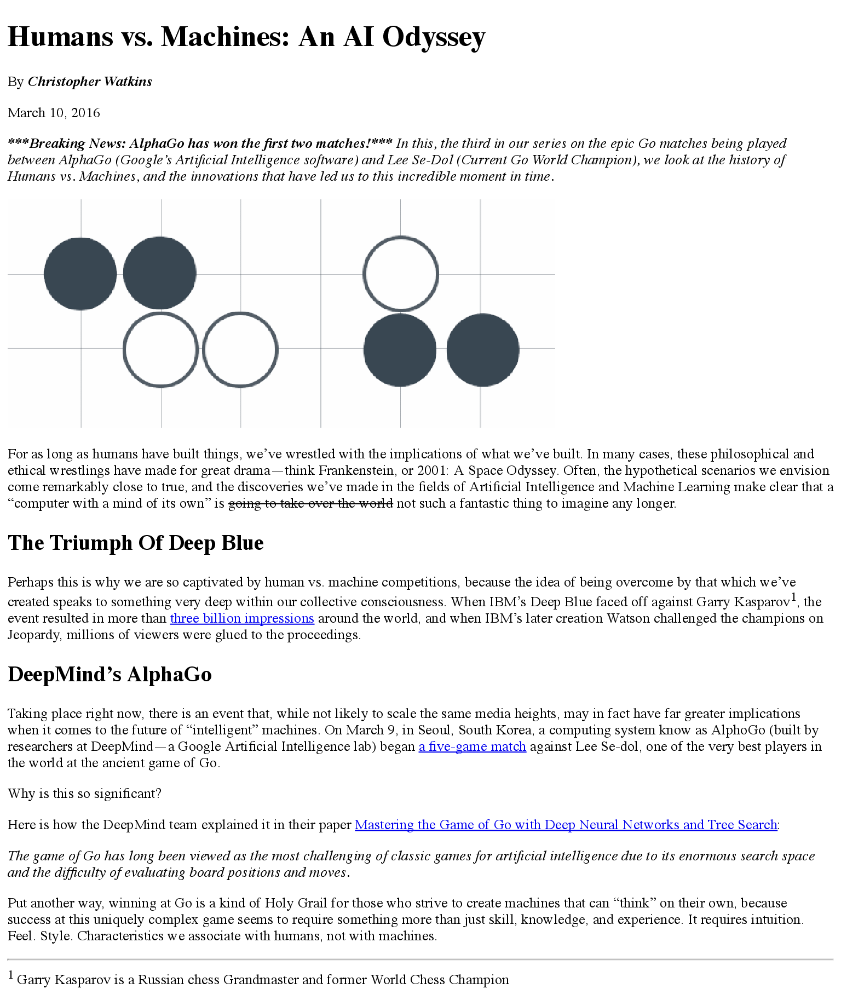

# mockup-to-article

### Here is a link to the live version https://karoldavid.github.io/mockup-to-article/

### Description

Edit index.html so that it looks exactly like the mockup image. 

### Mockup

### Resources

* [https://www.udacity.com/api/nodes/7359899771/supplemental_media/mockup-to-articlezip/download?_ga=1.234704733.210648082.1467388683](https://www.udacity.com/api/nodes/7359899771/supplemental_media/mockup-to-articlezip/download?_ga=1.234704733.210648082.1467388683)

* MDN []HTML element reference](https://developer.mozilla.org/en-US/docs/Web/HTML/Element)

* Udacity [HTML style guide](https://udacity.github.io/frontend-nanodegree-styleguide/)

### Contact

Write an email to k.zysk@zoho.com
